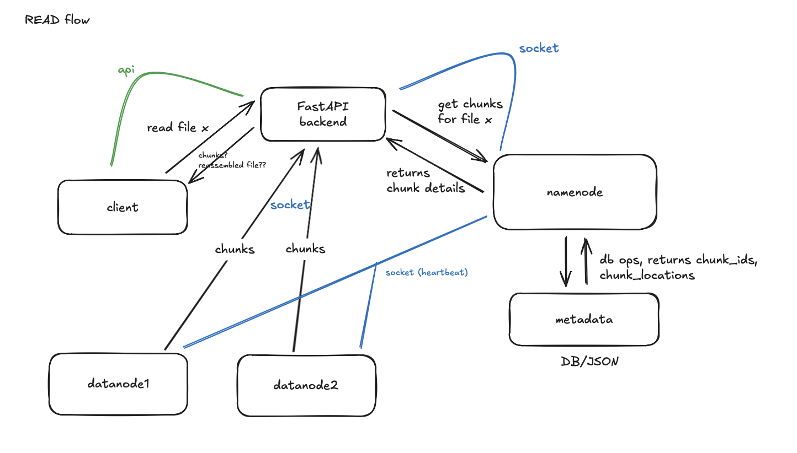
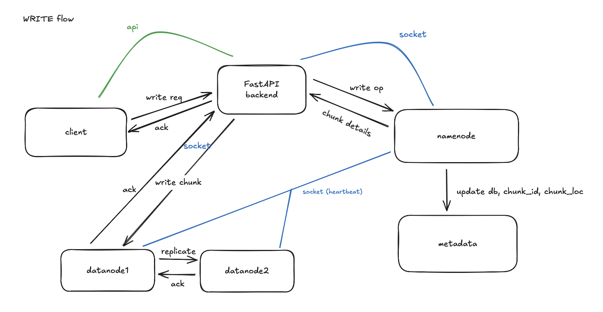

# Mini implementation of HDFS

## Read Implementation Structure


## Write Implementation Structure



# FOR DEMO
```
for demo:
1. on namenode:
	export NAMENODE_HOST=172.27.15.86
	export DATANODE1_HOST=<d1 zt ip>
	export DATANODE2_HOST=<d2 zt ip>
2. on datanode:
	export NAMENODE_HOST=172.27.15.86
	export DATANODE_HOST=<current zt ip>
	export DATANODE(x)_HOST=<other datanode zt ip>
	export DATANODE_ID=1/2
3. make changes to client/frontend/next.config.js --> change to backend zt ip
4. make changes in client/frontend/.env.local -> change to backend zt ip

5. start backend and namenode regularly
6. run datanodes with sudo -E
```

pending:
- Automatic Re-replication (Rebuild Logic) - You track dead nodes but don't automatically re-replicate chunks from failed nodes to healthy ones. This is the only partial feature.